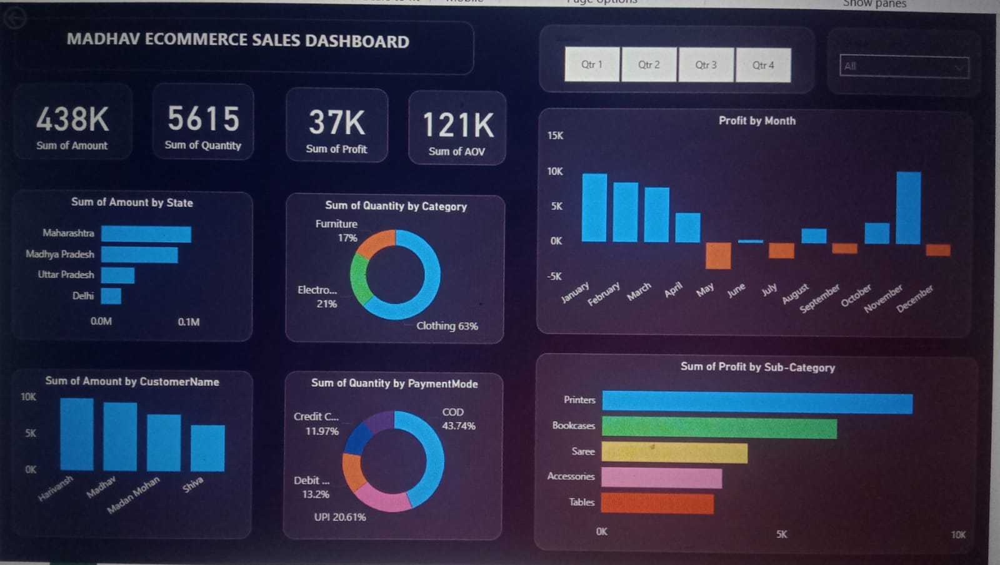

**Madhav Ecommerce Sales Dashboard**

📌 **Project Overview**

This project is a Sales Dashboard created to analyze ecommerce data.It helps in understanding sales performance, profit trends, customer behavior, and product insights.

**Features**

📈 Sales & Profit Analysis

🗺️ State-wise Sales Visualization

🧥 Category-wise Quantity Distribution

📅 Monthly Profit Trends

💳 Payment Mode Analysis

🛒 Customer-wise Sales Insights

🛠️** Tech Stack**

Power BI 

**Data Analysis**

📊 Dashboard Preview

📌 **Key Insights**

Maharashtra has highest sales

Clothing category dominates

COD is most used payment mode

Some months show negative profit
